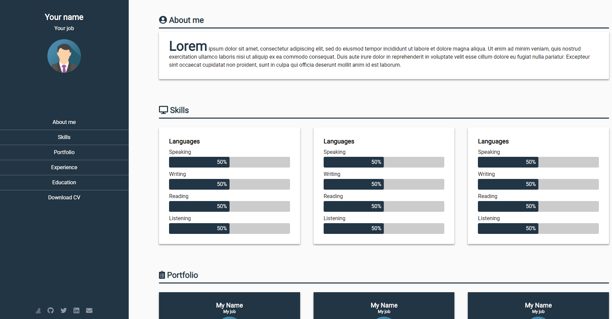
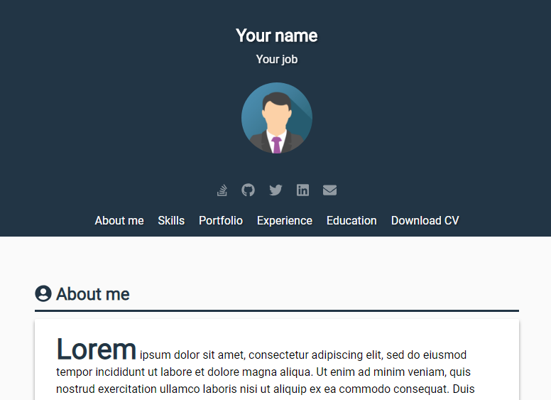
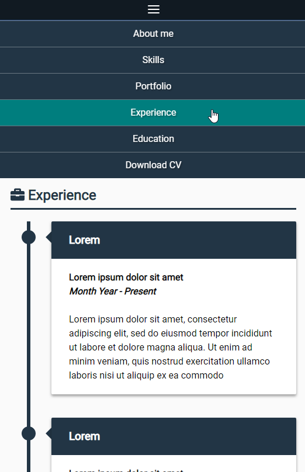

# cv-template &middot; 

A portfolio web template made just with HTML5 and CSS3 with full responsive design.

Just edit the index.html with your data and adjust the CSS if you want to. Check out root.css for variables.

## Demo (my own)

http://mrganser.com - My version is on [me](https://github.com/mrganser/cv-template/tree/me) branch if you want to check it out.

### Template screenshots

* Main page:

* Tablets size:

* Mobiles size:

## Getting Started

### Prerequisites

* A modern browser is recommended for better experience.

### Installing

* Clone the project

* Edit the files with an editor such as [VS Code](https://code.visualstudio.com/) and change it to your liking.
  * At root.css you can find all the important variables such as the main colors.

## Deployment

This project is ready to deploy anywhere as there are only .html, .css and image files.

## Built With

* HTML5 + CSS3
* FlexBox - Mainly when showing list of cards and inside the header.
* CSSGrid - Main layout: positioning header and main sections.
* CSS3 Animations - Appear, fade in...

## Versioning

We use [SemVer](http://semver.org/) for versioning. For the versions available, see the [tags on this repository](https://github.com/mrganser/cv-template/tags). 

## Authors

* **[mrganser](http://mrganser.com)**

See also the list of [contributors](https://github.com/mrganser/cv-template/contributors) who participated in this project.

## License

This project is licensed under the MIT License - see the [LICENSE](LICENSE) file for details
